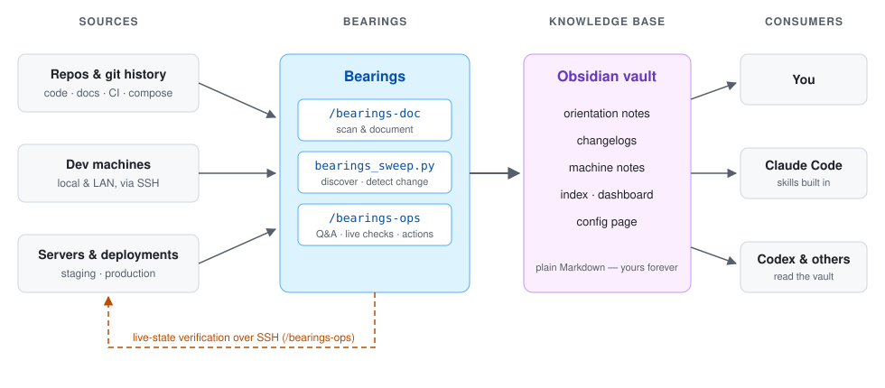

# Bearings

**A second brain for your development environment.**

Bearings builds and maintains a persistent knowledge base for your projects, machines, and deployments, so technical context does not disappear between coding sessions, machines, or months away from a project. It captures what you need to get your bearings quickly: **how a project is structured, how to run it, where it is deployed, configuration locations, dependencies, services, URLs, infrastructure, and what recently changed.**

The knowledge needed to work on a project rarely lives in one place — some is in the repo (README, compose files, CI, `.env.example`), some outside it (which machine runs what, ports, databases, SSH aliases, deploy processes), and some only in your memory. Bearings turns all of it into a **persistent, human-readable knowledge base in your Obsidian vault** that doubles as **architecture and operational context for coding agents**: Claude Code uses it directly through the Bearings skills, and pointers in `CLAUDE.md` / `AGENTS.md` make it discoverable to Codex and other agents.

> The goal: come back to any project after three months and understand how it works, how to run it, and where everything lives in under five minutes.

<picture>
  <source media="(prefers-color-scheme: dark)" srcset="assets/architecture-dark.svg">
  
</picture>

## Quick start

Requirements: [Claude Code CLI](https://claude.com/claude-code), Python 3, Git, an Obsidian vault. Remote machines need a non-interactive SSH alias (key auth).

```bash
git clone https://github.com/AdarBahar/bearings
cd bearings
./install.sh                 # links the skills into ~/.claude/skills
claude "/bearings-setup"     # interactive onboarding
```

Onboarding finds your Obsidian vaults, code directories, SSH aliases (live-tested), and GitHub identity; asks how automated refreshes should behave; creates the vault structure; and documents a few representative projects first so you can review the output before backfilling everything. Installing the daily scheduler is optional.

Daily use:

```bash
claude "/bearings-doc"                        # document/refresh the current project
claude "/bearings-ops <question>"             # ask about projects or infrastructure
python3 scripts/bearings_sweep.py --force     # discover & refresh now (--report: detect only)
scripts/install-schedule.sh --uninstall       # remove the scheduler
```

## What you get

**Project orientation notes.** One compact note per project: what it does, architecture and components, quick-start commands, environments and URLs, local dev setup, deployment process, configuration file locations and variable names (never values), dependencies, services, and where the project lives on your machines. Machine-readable frontmatter, human-readable Markdown. Protected manual sections — your next-steps, open questions, decisions — survive every regeneration.

**Project changelogs.** A summarized changelog per project, derived from Git history. Each refresh appends what changed since the last update.

**Machine and deployment notes.** Machine-level knowledge of where things run: services, containers, shared databases, ports, project locations — operational knowledge kept alongside project architecture instead of scattered across shell history and memory.

**Persistent context for coding agents.** Instead of starting cold every session ("Where is the database? How is this deployed? What port?"), agents start from the knowledge base. Claude Code integration is built in through the skills. For repos you own, Bearings adds an orientation-doc pointer to `CLAUDE.md` (always) and `AGENTS.md` (when the repo already has one), so Codex and other agents that read those files — or are given vault access — start oriented. The interactive skills and live-state checks are Claude Code features; other agents consume the generated Markdown.

**Plain-English Q&A — with live verification.** Ask anything:

```bash
claude "/bearings-ops how do I run project-a locally?"
claude "/bearings-ops which projects use the shared Postgres server?"
claude "/bearings-ops what's currently running on my server?"
```

Procedural and architectural questions are answered from the notes. Questions about *current state* are verified live first — Docker containers, systemd/launchd services, listening ports, PM2 processes — over the SSH access you configured; if a machine is unreachable, Bearings answers from the last documented state, labeled with its date. Asking *how* to do something returns instructions; asking Bearings to *do* it ("restart project-a") performs the action — directly for dev/local targets, with explicit confirmation for staging and production.

**A dashboard in Obsidian.** Every sweep records new/stale/up-to-date projects, unreachable machines, actions performed, token usage, estimated cost, monthly totals, and budget warnings. Newly discovered projects appear as checkboxes you approve directly from Obsidian.

## How it works

Three pieces, connected by the vault:

1. **`/bearings-doc`** (skill) scans a project — locally or over SSH — and creates or refreshes its orientation note and changelog.
2. **`bearings_sweep.py`** (dependency-free Python) discovers projects, detects stale notes, tracks new projects, processes dashboard approvals, optionally triggers refreshes, and updates the dashboard with usage and cost.
3. **`/bearings-ops`** (skill) answers questions from the knowledge base and verifies live state when the question depends on what is running now.

The Markdown files are the persistent layer — useful with or without any agent session. A typical vault:

```text
Bearings/
├── _Config.md          ← configuration (edit in Obsidian)
├── _Dashboard.md       ← sweep results, costs, approvals
├── _Index.md           ← one row per project
├── project-a/
│   ├── project-a.md    ← orientation: Resume here · Quick start · Environments
│   └── changelog.md       · Deployment · Configuration · Dependencies · Architecture · Links
└── linux-laptop/
    └── linux-laptop.md ← machine note
```

The intention is **orientation, not exhaustive documentation** — notes tell you where to look and how things fit; repo docs remain the source of depth.

## Configuration

Configuration lives in the vault as frontmatter on `_Config.md` — edit it in Obsidian (from any synced device) and the next sweep reads it. No reinstalls: the OS timer ticks daily and the page decides what happens.

```yaml
---
cadence: weekly-monday        # daily | weekly-<weekday> | manual
refresh_mode: report-only     # report-only | auto
create_new: ask               # ask | auto | never
budget_alert_usd: 0           # monthly warning threshold (0 = off)

machines:
  - "mac | local | ~/Code"
  - "linux-laptop | ssh=linux | ~/Code"

include: ["*"]                # project folder patterns to track
exclude: ["tmp-*"]            # exclude wins; scope per machine: "linux-laptop:tmp-*"

owners:                       # GitHub users/orgs whose repos count as yours
  - your-github-username

aliases:                      # map renamed/secondary checkouts to one note
  - "old-directory-name = project-name"
---
```

**Refresh model — detection is cheap, regeneration is not.** The sweep separates change *detection* (free — date comparisons and one SSH call per machine) from AI-powered *refreshes* (spend Claude usage). `refresh_mode: report-only` (default) only reports stale notes on the dashboard; `auto` invokes `/bearings-doc` for them. `create_new` controls newly discovered projects: `ask` queues them as dashboard checkboxes, `auto` documents them immediately, `never` ignores them. Non-Git folders are tracked only when explicitly included or already documented.

**Remote machines** are configured as SSH aliases (`name | ssh=alias | dirs`). Discovery over SSH is part of every sweep; letting *headless Claude runs* use SSH is a separate opt-in made during onboarding, stored with other machine-local settings in `~/.bearings/bearings.env`.

## Security model

- **No secret values, ever.** Notes record env-file locations and variable names/purposes. `/bearings-doc` never reads `.env` files — only safe sources like `.env.example` and references in code or deploy configs. Treat the vault folder as semi-public: it syncs wherever your vault syncs (Obsidian Sync, iCloud, Google Drive).
- **External repositories are never modified.** Repos not matching your `owners:` list are documented in the vault only; no file in their working tree is created or changed.
- **Actions are explicit and gated.** "How do I restart X?" returns instructions; "restart X" acts — and staging/production actions require confirmation of the exact command first.
- **Headless permissions are minimal and declared.** Scheduled runs get read/write on the vault plus `git`/`ls`, and SSH only if you opted in.
- **Nothing spends silently.** Every automated run's tokens and estimated cost land on the dashboard, with monthly totals and an optional budget alert.

## Repository internals

```text
skills/bearings-setup/       interactive onboarding and configuration
skills/bearings-doc/         project scanner → orientation notes + changelogs (local & SSH)
skills/bearings-ops/         Q&A over the vault, live-state verification, gated actions
scripts/bearings_sweep.py    discovery, staleness detection, approvals, dashboard, cost tracking
scripts/install-schedule.sh  daily trigger: launchd (macOS) / systemd user timer (Linux) / cron
templates/                   _Config.md, _Dashboard.md, project note template
assets/                      architecture diagram (light/dark)
install.sh                   links the skills into ~/.claude/skills
```

The daily trigger does not itself cause an AI refresh — the configured cadence and refresh policy determine what each sweep actually does.

**Design principles:** persistent over conversational · human-readable Markdown over opaque memory stores · the same knowledge serves you and your agents · orientation over exhaustive documentation · live state verified when it matters · architecture in the vault, credentials never.

## License

MIT
